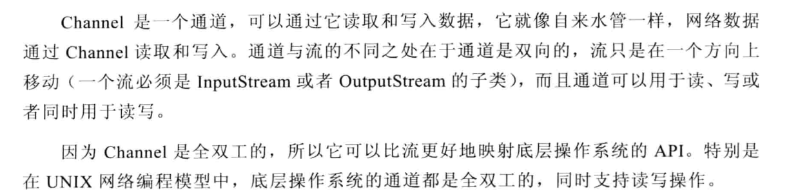
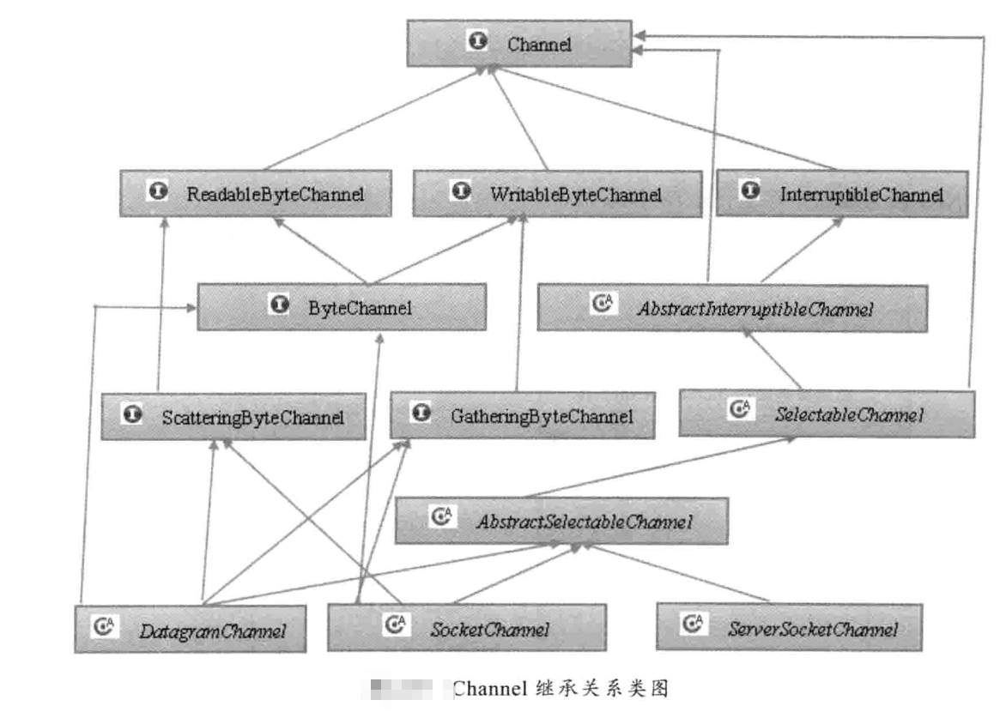
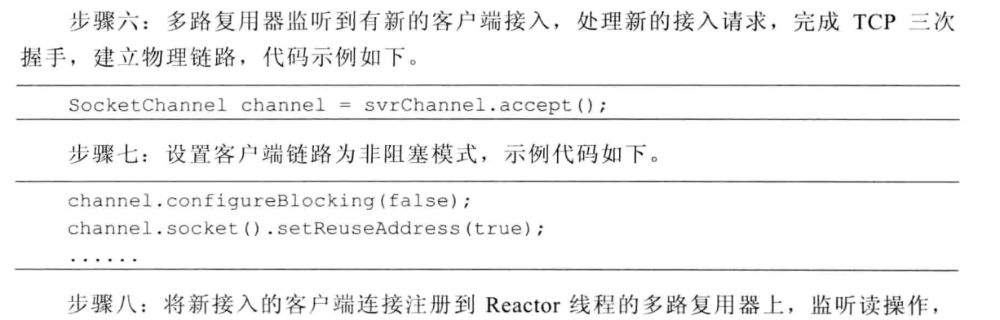
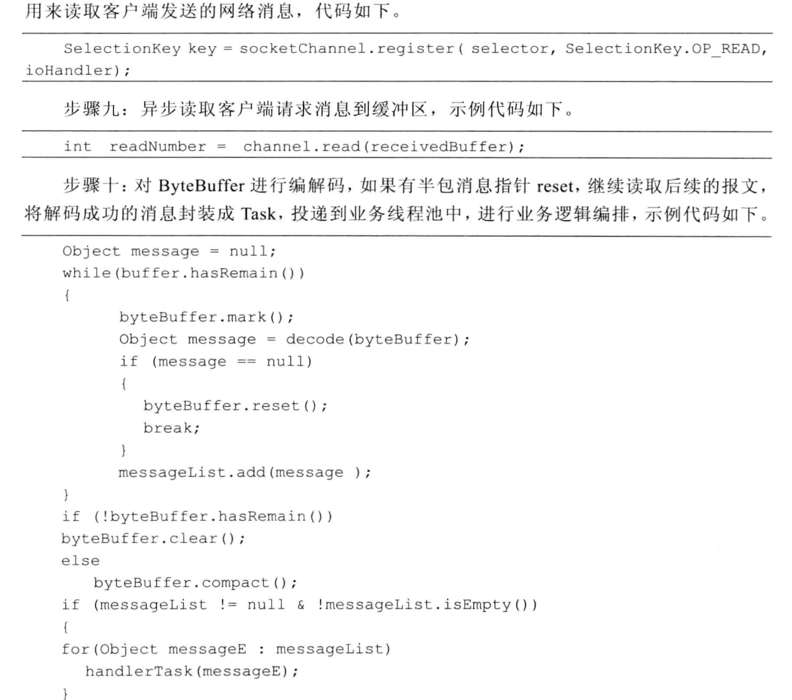
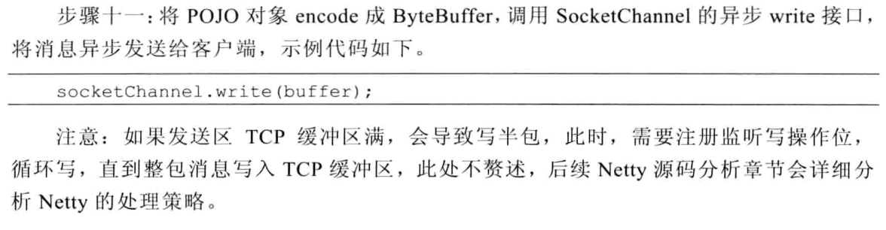
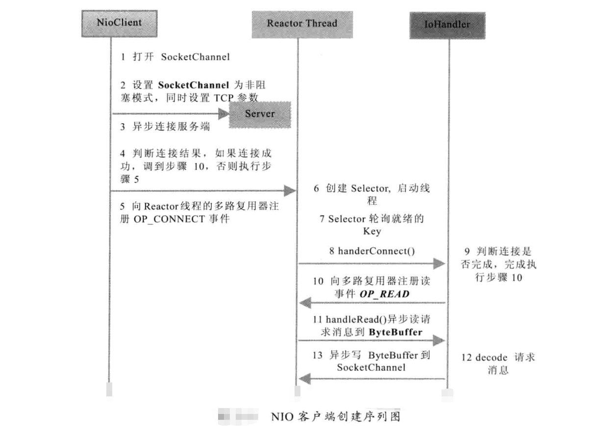
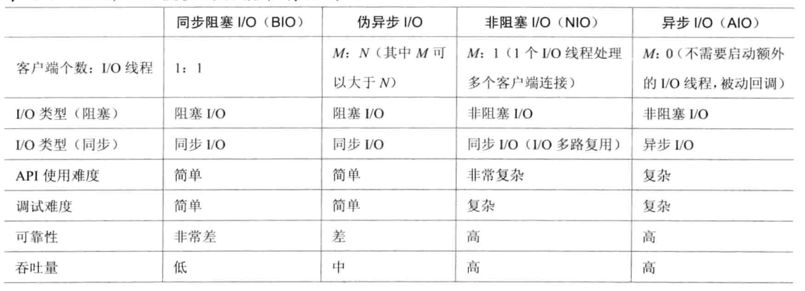
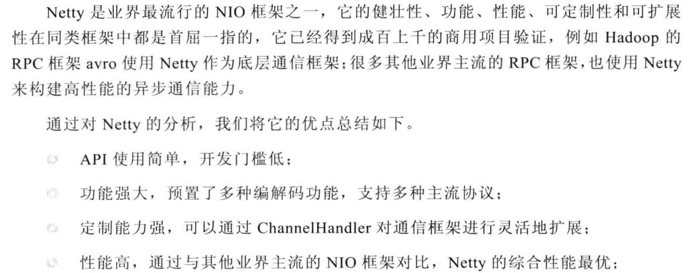
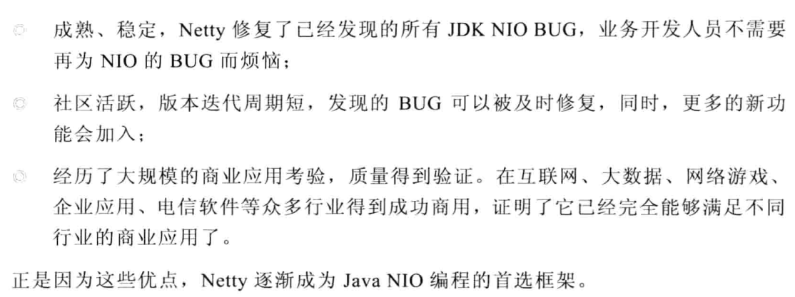

### I/O 与 NIO 

#### 1 I/O 基础入门

##### 1.1 java I/O 的演进
`java 1.4` 之前的早期版本，对 ` I/O ` 操作并不完善，` java 1.4 ` j加入了 `NIO`，引入了 `pipe` 、缓冲区、`channel`等概念，但是还是有很多不够完善的地方，尤其是文件操作方面，如：

- 没有统一的文件属性（例如读写权限）
- API 较弱，如文件的级联创建和递归遍历，需自己实现
- 所有文件读写都是同步阻塞操作，不支持异步读写操作

但在 2011 年的 `java 1.7` 更新的 `nio api` 中解决了上述问题，也被称为 `nio 2.0`

##### 1.2 linux 的 I/O 模型简介

- 阻塞 I/O 模型： 所有的 I/O 操作都是阻塞的，
- 非阻塞 I/O 模型
- I/O 复用模型：

 

- 信号驱动 I/O 模型
- 异步 I/O 模型：

##### 1.3 I/O 多路复用技术

在 I/O 编程过程中，当需要同时处理多个客户端接入请求时，可以利用多线程或者 I/O 多路复用技术进行处理。 I/O 多路复用技术通过把多个 I/O 的阻塞复用到同一个 select 的阻塞上，从而使得系统在单线程的情况下可以同时处理多个客户端请求。与传统的多线程/多进程模型比， I/O 多路复用的最大优势是系统开销小，系统不需要创建新的额外进程或者线程，也不需要维护这些进程和线程的运行,降低了系统的维护工作量，节省了系统资源， I/O 多路复用的主要应用场景如下：

- 服务器需要同时处理多个处于监听状态或者多个连接状态的套接字；
- 服务器需要同时处理多种网络协议的套接字

目前支持 I/O 多路复用的系统调用有 select、 pselect、 poll 、 epoll，在linux网络编程过程中，很长一段时间都使用select 做轮询和网络事件通知，然而 select 的一些固有缺陷导致了它的应用收到了很大的限制，最终 Linux 不得不在新的内核版本中寻找 select 的替代方案， 最终选择了 epoll. epoll 与 select 的原理比较类似，为了克服 select 的缺点，epoll 做了很多重大改进：

- 支持一个进程打开的 socket 描述符（FD）不受限制(仅受限于操作系统的最大文件句柄数)
- I/O 效率不会随着 FD 数目的增加而线性下降
- 使用 mmap 加速内核与用户空间的消息传递
- epoll 的 API 更加简单

#### 2 NIO入门
传统的 BIO 编程，每一个客户端的连接都需要一个新的线程来处理，当并发较高时会消耗大量的资源。

##### 2.1 nio 类库简介

- 缓冲区 Buffer

Buffer 继承关系图

- 通道 Channel

- 多路复用器 Selector

它是 Java NIO 编程的基础，熟练的掌握 Selector 对于掌握 NIO 编程至关重要。多路复用器提供选择已经就绪的任务的能力。简单来讲， Selector 会不断的轮询注册在其上的 Channel ，如果某个 Channel 上面有新的 TCP连接接入、读和事件，这个 Channel就处于就绪状态，会被 Secector 轮询出来，然后通过 SelectionKey 可以获取就绪 Chaanle 的集合，进行后续的 I/O 操作。

一个多路复用器 Selector 可以同时轮询多个 Channel， 由于 JDK 使用了 epoll() 代替传统的select实现，所以它并没有最大连接句柄 1024/2048 的限制。这也就意味着秩序要一个线程负责 Selector 的轮询，就可以接入成千上万的客户端，这确实是个非常巨大的进步。

##### 2.2 NIO 服务端序列图

##### 2.3 NIO 客户端序列图

##### 2.4 AIO 

NIO2.0 引入了新的异步通道的概念，并提供了异步文件通道和异步套接字通道的实现。异步通道提供两种方式获取操作结果。

- 通过 ` java.util.concurrent.Future ` 类来表示异步操作的结果；
- 在执行异步操作的时候传入一个 `java.nio.channels`

`CompletionHandler` 接口的实现类作为操作完成的回调。

NIO2.0 的异步套接字通道是真正的异步非阻塞 I/O ，他对应 UNIX 网络编程中的时间驱动 I/O (AIO),他不需要通过多路复用器 （Selector） 对注册的通道进行轮询操作即可实现异步读写，从而简化了 NIO 的编程模型。

##### 2.5 几种 I/O 模型的功能和特性对比

##### 2.6 建议使用 Netty 进行 NIO 开发的理由

###### 2.6.1 不建议使用原生 NIO 开发的理由

###### 2.6.2 建议使用 Netty 的理由

